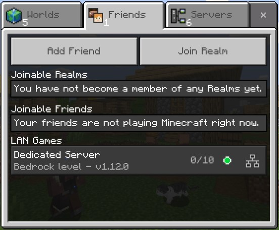

[](https://hub.docker.com/r/itzg/minecraft-bedrock-server/)
[](https://github.com/itzg/docker-minecraft-bedrock-server/issues)
[](https://github.com/itzg/docker-minecraft-bedrock-server/actions?query=workflow%3ABuild)
[](https://discord.gg/ScbTrAw)
[](https://www.buymeacoffee.com/itzg)

## Quickstart

The following starts a Bedrock Dedicated Server running a default version and
exposing the default UDP port: 

```bash
docker run -d -it -e EULA=TRUE -p 19132:19132/udp itzg/minecraft-bedrock-server
```

> **NOTE**: if you plan on running a server for a longer amount of time it is highly recommended using a management layer such as [Docker Compose](#deploying-with-docker-compose) or [Kubernetes](#deploying-with-kubernetes) to allow for incremental reconfiguration and image upgrades.

## Upgrading to the latest Bedrock server version

With the `VERSION` variable set to `LATEST`, which is the default, then the Bedrock server can be upgraded by restarting the container. At every startup, the container checks for the latest version and upgrades, if needed.

## Looking for a Java Edition Server

For Minecraft Java Edition you'll need to use this image instead:

[itzg/minecraft-server](https://hub.docker.com/r/itzg/minecraft-server)

## Environment Variables

### Container Specific

- `EULA` (no default) : must be set to `TRUE` to 
  accept the [Minecraft End User License Agreement](https://minecraft.net/terms)
- `VERSION` (`LATEST`) : can be set to a specific server version or the following special values can be used:
  - `LATEST` : determines the latest version and can be used to auto-upgrade on container start
  - `PREVIOUS` : uses the previously maintained major version. Useful when the mobile app is gradually being upgraded across devices
  - `1.11` : the latest version of 1.11
  - `1.12` : the latest version of 1.12
  - `1.13` : the latest version of 1.13
  - `1.14` : the latest version of 1.14
  - `1.16` : the latest version of 1.16
  - otherwise any specific server version can be provided to allow for temporary bug avoidance, etc
- `UID` (default derived from `/data` owner) : can be set to a specific user ID to run the
  bedrock server process
- `GID` (default derived from `/data` owner) : can be set to a specific group ID to run the
  bedrock server process
- `PACKAGE_BACKUP_KEEP` (`2`) : how many package backups to keep

### Server Properties

The following environment variables will set the equivalent property in `server.properties`, where each [is described here](https://minecraft.gamepedia.com/Server.properties#Bedrock_Edition_3).

- `SERVER_NAME`
- `SERVER_PORT`
- `SERVER_PORT_V6`
- `GAMEMODE`
- `DIFFICULTY`
- `LEVEL_TYPE`
- `ALLOW_CHEATS`
- `MAX_PLAYERS`
- `ONLINE_MODE`
- `WHITE_LIST`
- `VIEW_DISTANCE`
- `TICK_DISTANCE`
- `PLAYER_IDLE_TIMEOUT`
- `MAX_THREADS`
- `LEVEL_NAME`
- `LEVEL_SEED`
- `DEFAULT_PLAYER_PERMISSION_LEVEL`
- `TEXTUREPACK_REQUIRED`
- `SERVER_AUTHORITATIVE_MOVEMENT`
- `PLAYER_MOVEMENT_SCORE_THRESHOLD`
- `PLAYER_MOVEMENT_DISTANCE_THRESHOLD`
- `PLAYER_MOVEMENT_DURATION_THRESHOLD_IN_MS`
- `CORRECT_PLAYER_MOVEMENT`

For example, to configure a flat, creative server instead of the default use:

```bash
docker run -d -it --name bds-flat-creative \
  -e EULA=TRUE -e LEVEL_TYPE=flat -e GAMEMODE=creative \
  -p 19132:19132/udp itzg/minecraft-bedrock-server
```

## Exposed Ports

- **UDP** 19132 : the Bedrock server port. 
  **NOTE** that you must append `/udp` when exposing the port, such as `-p 19132:19132/udp`
  
## Volumes

- `/data` : the location where the downloaded server is expanded and ran. Also contains the
  configuration properties file `server.properties`

You can create a `named volume` and use it as:

```shell
docker volume create mc-volume
docker run -d -it --name mc-server -e EULA=TRUE -p 19132:19132/udp -v mc-volume:/data itzg/minecraft-bedrock-server
```

If you're using a named volume and want the bedrock process to run as a non-root user then you will need to pre-create the volume and `chown` it to the desired user.

For example, if you want the bedrock server to run with user ID 1000 and group ID 1000, then create and chown the volume named "bedrock" using:

```shell script
docker run --rm -v bedrock:/data alpine chown 1000:1000 /data
```

If using `docker run` then simply reference that volume "bedrock" in the `-v` argument. If using a compose file, declare the volume as an external using this type of declaration:

```yaml
volumes:
  bedrock:
    external:
      name: bedrock
```

## Connecting

When running the container on your LAN, you can find and connect to the dedicated server
in the "LAN Games" part of the "Friends" tab, such as:



## Permissions

The Bedrock Dedicated Server requires permissions be defined with XUIDs. There are various tools to look these up online and they
are also printed to the log when a player joins. There are 3 levels of permissions and 3 options to configure each group:

- `OPS` is used to define operators on the server.  
```shell
-e OPS "1234567890,0987654321"
```
- `MEMBERS` is used to define the members on the server.
```shell
-e MEMBERS "1234567890,0987654321"
```
- `VISITORS` is used to define visitors on the server.
```shell
-e VISITORS "1234567890,0987654321"
```

## Whitelist

There are two ways to handle a whitelist. The first is to set the `WHITE_LIST` environment variable to true and map in [a whitelist.json](https://minecraft.gamepedia.com/Whitelist.json) that is custom-crafted to the container. The other is to use the `WHITE_LIST_USERS` environment variable to list users that should be whitelisted. This list is player names. The server will look up the names and add in the XUID to match the player.

```shell
-e WHITE_LIST_USERS="player1,player2,player3"
```

> Starting with 1.16.230.50, `ALLOW_LIST`, `ALLOW_LIST_USERS`, and the file `allowlist.json` will be used instead.

## Mods Addons 

Also known as behavior or resource packs, in order to add mods into your server you can follow these steps, tested with [OPS (One Player Sleep)](https://foxynotail.com/addons/ops/) and [bedrocktweaks](https://bedrocktweaks.net/resource-packs/)

1. Install the mcpack or mcaddon on the client side first, just to make it easier to copy the files to the server, for Windows 10 files should be located on `C:\Users\USER\AppData\Local\Packages\Microsoft.MinecraftUWP_*\LocalState\games\com.mojang`.
2. Copy over the folders of the mods from either behavior_packs or resource_packs into the server's volume.
> If you want to install them without using a client you should be able to unzip the mods directly into the server's volume, .mcaddon should go into behavior_packs and .mcpack into resource_packs. Both .mcaddon and .mcpack are actually renamed .zip files.
3. On the server's volume we will need to edit `valid_known_packs.json`, you can just copy and paste the definition of another pack and replace path, uuid and version with the mod being installed, uuid and version can be found on the mod behavior or resource _packs/mod/manifest.json, path is the path to the mod's folder.
```
	{
		"file_system" : "RawPath",
		"path" : "behavior_packs/Foxy'sOneP",
		"uuid" : "5f51f7b7-85dc-44da-a3ef-a48d8414e4d5",
		"version" : "3.0.0"
	}
```
4. Lastly create on the server's volume `worlds/$level-name/world_behavior_packs.json`, you'll need to add an entry for each mod like on the previous manifest.json, we only need the uuid now called pack_id and the version replacing dots with commas and double quotes with [ ].
> You can also create a `worlds/$level-name/world_resource_packs.json` but I have seen that putting both resource and behavior packs inside the same json works just fine
```
[
	{
		"pack_id" : "5f51f7b7-85dc-44da-a3ef-a48d8414e4d5",
		"version" : [ 3, 0, 0 ]
	}
]
```
5. Restart the server and the mods should be enabled now! when connecting you will get a prompt asking if you want to "Download & Join" or just "Join", You need to Download & Join if you want to actually see the new resource pack added to the server.
This prompt is exclusive to resource packs as these alter how minecraft looks while behavior packs alter how minecraft functions and don't need to be downloaded or installed on the client side.
> If you want to force the resource pack on all clients, there's an option `texturepack-required=false` in `server.properties` that should be changed to `true`.
> Resource packs can be deleted by going into Settings > Storage > Cached Data, then selecting the pack and clicking on the trash can.

For more information [FoxyNoTail](https://www.youtube.com/watch?v=nWBM4UFm0rQ&t=1380s) did a video explaining the same on a server running on Windows.

## More information

For more information about managing Bedrock Dedicated Servers in general, [check out this Reddit post](https://old.reddit.com/user/ProfessorValko/comments/9f438p/bedrock_dedicated_server_tutorial/).

## Executing server commands

Assuming you started container with stdin and tty enabled (such as using `-it`), you can attach to the container's console by its name or ID using:

```shell script
docker attach CONTAINER_NAME_OR_ID
``` 

While attached, you can execute any server-side commands, such as op'ing your player to be admin:

```
op YOUR_XBOX_USERNAME
```

When finished, detach from the server console using Ctrl-p, Ctrl-q

## Deploying with Docker Compose

The [examples](examples) directory contains [an example Docker compose file](examples/docker-compose.yml) that declares:
- a service running the bedrock server container and exposing UDP port 19132
- a volume to be attached to the service

The service configuration includes some examples of configuring the server properties via environment variables:
```yaml
environment:
  EULA: "TRUE"
  GAMEMODE: survival
  DIFFICULTY: normal
```

From with in the `examples` directory, you can deploy the composition by using:

```bash
docker-compose up -d
```

You can follow the logs using:
```bash
docker-compose logs -f bds
```

## Deploying with Kubernetes

The [examples](examples) directory contains [an example Kubernetes manifest file](examples/kubernetes.yml) that declares:
- a peristent volume claim (using default storage class)
- a pod deployment that uses the declared PVC
- a service of type LoadBalancer

The pod deployment includes some examples of configuring the server properties via environment variables:
```yaml
env:
- name: EULA
  value: "TRUE"
- name: GAMEMODE
  value: survival
- name: DIFFICULTY
  value: normal
```

The file is deploy-able as-is on most clusters, but has been confirmed on [Docker for Desktop](https://docs.docker.com/docker-for-windows/kubernetes/) and [Google Kubernetes Engine](https://cloud.google.com/kubernetes-engine/docs/):

```bash
kubectl apply -f examples/kubernetes.yml
```

You can follow the logs of the deployment using:

```bash
kubectl logs -f deployment/bds
```

## Community Solutions

- [kaiede/minecraft-bedrock-backup image](https://hub.docker.com/r/kaiede/minecraft-bedrock-backup) by @Kaiede
- [ghcr.io/edward3h/mc-webhook](https://github.com/edward3h/minecraft-webhook) by @edward3h
- [Minecraft Bedrock Server Bridge](https://github.com/macchie/minecraft-bedrock-server-bridge) by @macchie
